<div  style="background-color:  #101010; padding:  2.2rem; border-radius:  1rem; border:  solid  1px  #252525; color:  #eee">

  
# Lucas Silva


### I'm Full-Stack Developer 💻

```js
import { JS } from '@life/core'
```

  

<div  style="display:  flex; gap:  1.5rem">

  




</div>


### Stack
 

[](https://skillicons.dev)

  

</div>
